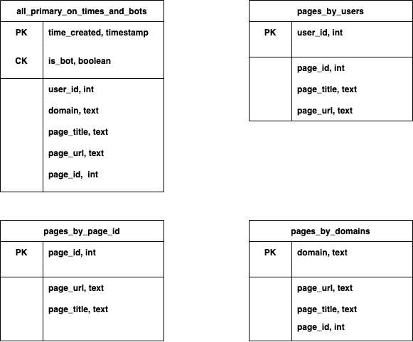

# BigDataCourseProject
**Authors:** ***Roman Pavelko***, ***Nazar Dobrovolskyi***

Hi!

Here is our  project for the Big Data course at UCU, where we solve the problem of analysis of streaming data
by using Cassandra and writing data into its tables, and further retrieving that data to answer number-specific questions, formed
as requests.

In the directory `DOCS` (as well as in the photo below) you can find the diagram of our Cassandra database and what tables we inserted data into, 
as well as more detailed explanation of their structure and purposes.




In order to run the code, you need to do that in the following order and way:

- Start the cassandra network and create tables in it by running `bash run-cassandra-cluster.sh`

- Start reading streaming data and writing it into Cassandra by running `bash write-cassandra.sh`

- Start reading data from Cassandra and putting it on the api `bash read-cassandra.sh`

- Now you can test api endpoints in the new terminal window

- Once finished with Cassandra, run `bash shutdown-cassandra.sh`

## Endpoints

### A1
#### Return the aggregated statistics containing the number of created pages for each Wikipedia domain for each hour in the last 6 hours, excluding the last hour.

```
curl -iX GET 'http://127.0.0.1:8080/a_query_1'
```

### A2
#### Return the statistics about the number of pages created by bots for each of the domains for the last 6 hours, excluding the last hour.

```
curl -iX GET 'http://127.0.0.1:8080/a_query_2'
```

### A3
#### Return Top 20 users that created the most pages during the last 6 hours, excluding the last hour. The response should contain user name, user id, start and end time, the list of the page titles, and the number of pages created.

```
curl -iX GET 'http://127.0.0.1:8080/a_query_3'
```

### B1
####  Return the list of existing domains for which pages were created.

```
curl -iX GET 'http://127.0.0.1:8080/b_query_1'
```

### B2
#### Return all the pages which were created by the user with a specified user_id.

```
curl -iX POST -H "Content-Type: application/json" \
            -d '{"user_id": 11260960}' \
            'http://127.0.0.1:8080/b_query_2'
```

### B3
#### Return the number of articles created for a specified domain.

```
curl -iX POST -H "Content-Type: application/json" \
            -d '{"domain": "pl.wikipedia.org"}' \
            'http://127.0.0.1:8080/b_query_3'
```

### B4
#### Return the page with the specified page_id.

```
curl -iX POST -H "Content-Type: application/json" \
            -d '{"page_id": "119170884"}' \
            'http://127.0.0.1:8080/b_query_4'
```

## B5
#### Return the id, name, and the number of created pages of all the users who created at least one page in a specified time range.

```
curl -iX POST -H "Content-Type: application/json" \
            -d '{"start": "2022-06-11 10:33:00", "end": "2022-06-11 12:43:00"}' \
            'http://127.0.0.1:8080/b_query_5'
```